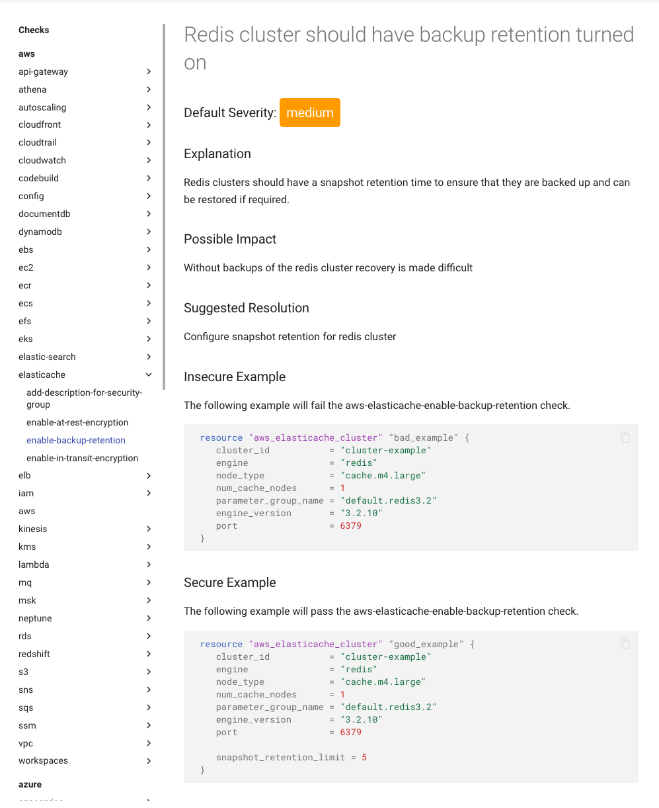
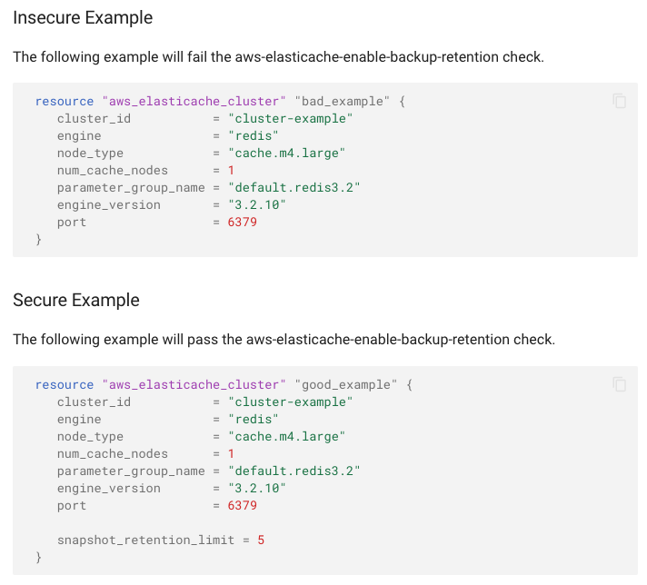
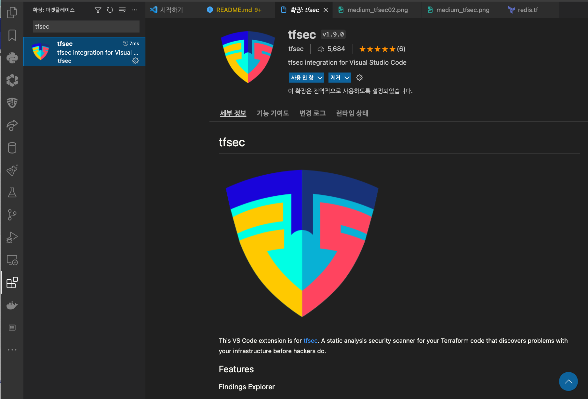
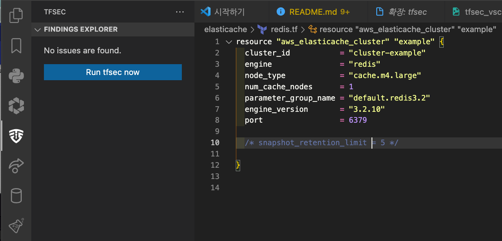
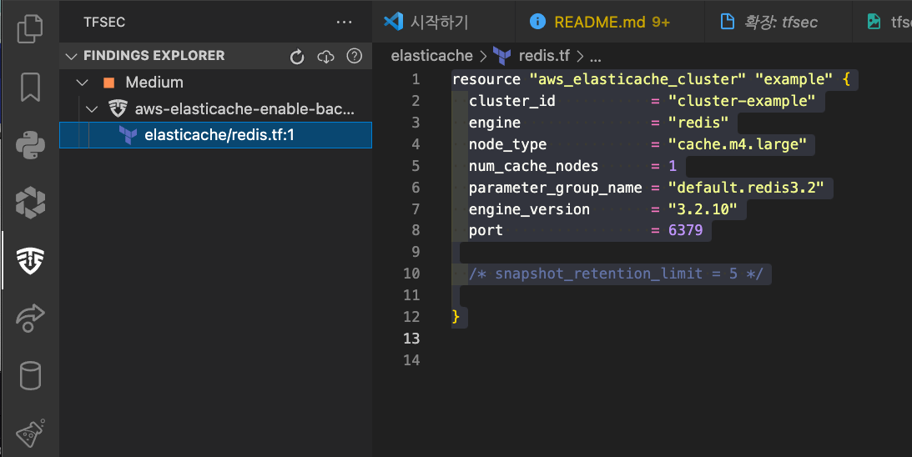
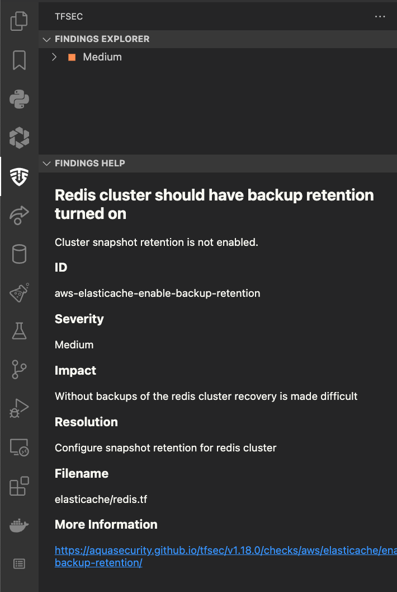

# tfsec 사용기

- tfsec 은 테라폼의 정적 분석 도구이며 잠재적인 위험이나, 잘못된 설정을 찾아내는데 도움을 주는 도구이다. 

## 기능

- 모든 메이저 클라우드 프로파이더를 통해서 잘못설정된 내역을 찾아낸다. 
- 수백개의 내장 룰을 참조한다. 
- 모듈을 스캔한다. (local and remote)
- HCL 표현식을 검증하여 리터럴값 평가 
- 테라폼 함수 검증 (concat()등)
- 테라폼 리소스 간의 관계를 평가한다. 
- 테라폼 CDK와 호환된다. 
- 사용자 정의 Rego 정책을 적용(및 장식)
- 복수개의 출력 포맷을 지원한다. CLI, JSON, SARIF, CSV, CheckStyle, Junit
- 설정가능 (CLI 플래그들 그리고 설정파일을 이용한다.)
- 매우 빠르며, 많은 리포지토리를 빠르게 스캔할 수 있다. 
- 인기있는 IDE에서 이용가능 (JetBrain, VSCode, Vim)
- 커뮤니티 드리븐으로 Slack과 함께 이용 


## 설치하기 

### brew 로 설치 

```py
brew install tfsec
```

### Chocolatey

```py
choco install tfsec
```

### Scoop

```py
scoop install tfsec
```

### Go를 이용하여 설치하기. 

```py
go install github.com/aquasecurity/tfsec/cmd/tfsec@latest
```

## 사용법 

### 커맨드라인 툴로 이용하기. 

- tfsec을 이용하는 가장 쉬운 방법은 스캔하고자 하는 디렉토리에서 다음 명령을 수행하는 것이다. 

```py
tfsec
```

- tfsec은 현재 디렉토리를 탐색하여 Terraform 파일을 찾아 적법한지 확인한다. 
- 만약 특정 로케이션을 지정하고자 한다면 아규먼트로 전달할 수 있다. 

```py
tfsec ./tf/prod
```

- 문제를 찾으면 종료 상태는 0이 아니고, 그렇지 않으면 종료 상태는 0이 됩니다. 

### Docker 이용하기. 

- 인스톨 대한으로 tfsec 을 Docker Container로 수행하는 것이다. 

```py
docker run --rm -it -v "$(pwd):/sec" aquasec/tfsec /src
```

### CI 이용하는경우 

- tfsec은 빌드 중단 여부를 지시하는 종료 코드를 통해 모든 CI 파이프라인에 추가할 수 있다. 

### Passing Arguments

- 이 페이지는 오직 tfsec이 할 수 있는 일에 대한 기본 사항만을 다르고 있다. 
- 매개 변수 페이지의 인수를 사용하여 훨씬 더 많은 일을 할 수 있다.

## Parameters

- tfsec --help 으로 파라미터를 확인할 수 있다. 

```py
tfsec --help
```

```py
tfsec은 terraform 으로 구성된 인프라스트럭쳐의 잠재적인 보안 취약점을 검출하는 툴이다. 

Usage:
  tfsec [directory] [flags]

Flags:
      --concise-output               출력의 양을 줄이고, 통계를 출력하지 않는다. 
      --config-file string           실행되는 동안 설정 파일을 이용한다. 
      --custom-check-dir string      dir 위치에 명시적으로 커스텀 체크를 수행한다.
      --debug                        디버그 로깅을 활성화 한다. (verbose와 같다.)
  -G, --disable-grouping             유사한 결과들의 그루핑을 비활성화 한다. 
  -e, --exclude string               실행할때 제외할 룰 ID를 지정하며 콤마로 구분하여 목록을 전달할 수 있다. 
      --exclude-downloaded-modules   .terraform 폴터에서 다운로드된 모듈들에 대한 결과를 제거한다. 
      --exclude-path strings         제외할 폴더를 지정한다. 기술된 순서에 따라 수행되며 여러번 사용할 수 있다. 
      --filter-results string        특정 검사만 반환하도록 결과를 필터링한다. (콤마로 구분된 입력을 지원한다.)
      --force-all-dirs               tf파일에 대한 검색없이, 제공된 디렉토리 아래 모든 내용을 검사한다.
  -f, --format string                출력 포맷을 선택한다. lovely, json, csv, checkstyle, junit, sarif. 복수개의 포맷을 지정하기 위해서 콤마와 --out을 통해서 출펵 파일 이름을 지정한다. 출력은 각 타입에 따라 파일이 작성된다. 첫번째 format 은 추가적으로 stdout으로 출력이 되며 기본 형식은 "lovely"이다.
  -h, --help                         tfsec 에 대한 도움말 
      --ignore-hcl-errors            HCL 파서 에러가 발견되면 이 에러를 리포팅하지 않는다.     Do not report an error if an HCL parse error is encountered
      --include-ignored              아무 효과가 없는 댓글을 무시하고 모든 리소스를 검색합니다. 결과 출력에 무시된 검사를 포함한다. 
      --include-passed               검사를 통과한 리소스의 결과 출력에 포함됩니다. 결과 출력에 passed 된 검사를 포함한다. 
      --migrate-ignores              무시된 코드들을 새로운 ID 구조에 이관된다. 
  -m, --minimum-severity string      보고할 결과의 최소 심각정도 입니다. CRITICAL, HIGH, MEDIUM, LOW 중 하나입니다. 
      --no-color                     색상으로 출력을 하는것을 비활성화 한다. (미국 스타일)
      --no-colour                    색상화된 출력을 비활성화 한다.  
      --no-ignores                   무시된 룰 어떤것도 적용하지 않는다. 보통은 무시된 체크는 실패한다. 
      --no-module-downloads          원격 모듈을 다운로드 하지 않는다. 
  -O, --out string                   출력 파일을 설정합니다. --format으로 여러 형식이 지정된 경우 이 파일 이름에는 형식 설명자가 추가됩니다. 
      --print-rego-input             rego 정책에 제공된 입력의 JSON 표현을 인쇄합니다.
      --rego-only                    레고 정책을 독점적으로 실행합니다.
      --rego-policy-dir string       (재귀적으로) rego 정책을 로드할 디렉터리입니다.
      --run-statistics               현재 조사 결과의 통계 테이블을 봅니다.
      --single-thread                단일 쓰레드를 이용하여 검사를 수행한다. 
  -s, --soft-fail                    검사를 실행하지만 오류 코드를 표시하지 않습니다.
      --tfvars-file strings          .tfvars 파일에 대한 경로, 여러 번 사용할 수 있으며 사양 순서대로 평가할 수 있습니다.
      --update                       최종 버젼을 업데이트한다. 
      --verbose                      자세한 로깅 활성화(디버그와 동일) 
  -v, --version                      버전 정보 표시 및 종료
  -w, --workspace string             무시 제한에 대한 작업 공간 지정(기본값 "기본값")
```

## Config File

- tfsec 설정 파일은 다양한 tfsec 설정을 오버라이드 할 수 있다. 
- tfsec config 파일은 config.json 또는 config.yml이라는 루트 확인 경로의 .tfsec 폴더에 있는 파일이며 존재하는 경우 자동으로 로드됩니다.
- 설정 파일은 또한 --config-file 옵션으로 설정할 수 있다. 

```py
tfsec --config-file tfsec.yml
```

### Minimum Severity

- 보고해야 하는 결과의 최소 심각도를 지정할 수 있다. 기본적으로 모든 심각도가 보고 된다. 
- CRITICAL, HIGH, MEDIUM, LOW 중 하나를 사용해야한다. 

```py
{
  "minimum_severity": "MEDIUM"
}
```

- 혹은 yaml 에 다음과 같이 지정할 수 있다. 

```py
---
minimum_severity: MEDIUM
```

### 문법, 오버라이드 

#### 심각도 오버라이드 하기 

- 기본 제공 검사 중 하나에 대한 기본 심각도 수준이 너무 심하거나 경우에 따라 충분히 강력하지 않은 경우가 있습니다.
- 구성 파일을 사용하여 결과 출력을 대체할 검사 식별자에 대한 재정의를 지정할 수 있다. 

```py
{
  "severity_overrides": {
    "CUS002": "ERROR",
    "aws-s3-enable-versioning": "LOW"
  }
}

```

- 혹은 yaml에 다음과 같이 지정한다. 

```py
---
severity_overrides:
  CUS002: ERROR
  aws-s3-enable-versioning: HIGH

```

#### 검사 포함하기 

- 일부 상황에서는 검사의 하위 집합만 검색할 수 있습니다. 이는 CI에 추가하기 전에 새로 추가된 검사를 평가해야 하는 경우일 수 있습니다.
- 명령줄에서 포함된 검사를 통과하는 옵션을 제거했지만 구성 파일에 추가할 수 있습니다.

```py
{
  "include": ["CUS002", "aws-s3-enable-versioning"]
}

```

- 혹은 yaml 에 다음과 같이 지정한다. 

```py
---
include:
  - CUS002
  - aws-s3-enable-versioning

```

#### 검사 제외하기 

- 제외하려는 검사 목록이 점점 더 커지는 순간이 있습니다. 
- 명령줄을 통해 제외된 모든 검사를 전달하는 대신 구성 항목 제외할 검사 항목을 나열할 수 있다.

```py
{
  "exclude": ["CUS002", "aws-s3-enable-versioning"]
}
```

- 혹은 yaml 에 다음과 같이 지정한다. 

```py
---
exclude:
  - CUS002
  - aws-s3-enable-versioning
```

#### 최소 요구버젼 

- CI의 경우 중앙에서 관리되는 구성 파일을 사용하여 모든 빌드 프로세스에 구성 파일을 가져올 수 있습니다. 
- 이 경우 최소 tfsec 버전을 사용해야 할 수도 있습니다.

- 이것은 min_required_version 설정을 사용하여 구성 파일에서 달성할 수 있습니다.
  
```py
{
  "min_required_version": "v1.1.2"
}
```

- or in yaml

```yaml
---
min_required_version: v1.1.2

```

## 실제 검사하기. 

- 이제는 직접 Terraform 을 생성하고 검사를 수행해 보자. 

- redis.tf 파일 작성하기. 

```terraform
resource "aws_elasticache_cluster" "example" {
  cluster_id           = "cluster-example"
  engine               = "redis"
  node_type            = "cache.m4.large"
  num_cache_nodes      = 1
  parameter_group_name = "default.redis3.2"
  engine_version       = "3.2.10"
  port                 = 6379
}
````

### 결과 

```py
$ cd elasticache
$ tfsec

Result #1 MEDIUM Cluster snapshot retention is not enabled. 
────────────────────────────────────────────────────────────────────────────────────────────────────────────────────────────────────────────────────────────────────────────────────────────────────────────
 redis.tf Lines 1-9
───────┬────────────────────────────────────────────────────────────────────────────────────────────────────────────────────────────────────────────────────────────────────────────────────────────────────
    1  │ resource "aws_elasticache_cluster" "example" {
    2  │   cluster_id           = "cluster-example"
    3  │   engine               = "redis"
    4  │   node_type            = "cache.m4.large"
    5  │   num_cache_nodes      = 1
    6  │   parameter_group_name = "default.redis3.2"
    7  │   engine_version       = "3.2.10"
    8  │   port                 = 6379
    9  │ }
───────┴────────────────────────────────────────────────────────────────────────────────────────────────────────────────────────────────────────────────────────────────────────────────────────────────────
          ID aws-elasticache-enable-backup-retention
      Impact Without backups of the redis cluster recovery is made difficult
  Resolution Configure snapshot retention for redis cluster

  More Information
  - https://aquasecurity.github.io/tfsec/v1.18.0/checks/aws/elasticache/enable-backup-retention/
  - https://registry.terraform.io/providers/hashicorp/aws/latest/docs/resources/elasticache_cluster#snapshot_retention_limit
────────────────────────────────────────────────────────────────────────────────────────────────────────────────────────────────────────────────────────────────────────────────────────────────────────────


  timings
  ──────────────────────────────────────────
  disk i/o             55.087µs
  parsing              267.486µs
  adaptation           4.740901ms
  checks               16.876641ms
  total                21.940115ms

  counts
  ──────────────────────────────────────────
  modules downloaded   0
  modules processed    1
  blocks processed     1
  files read           1

  results
  ──────────────────────────────────────────
  passed               0
  ignored              0
  critical             0
  high                 0
  medium               1
  low                  0

  1 potential problem(s) detected.
```

- 위와 같이 MEDIUM 심각도로 1개의 결과가 출력 되었다. 
- https://aquasecurity.github.io/tfsec/v1.18.0/checks/aws/elasticache/enable-backup-retention/ 로 찾아가보면 원인과 해결책을 확인할 수 있다. 



- 백업 리텐션을 켜야한다라고 알려준다. 



- Insecure Example 항목은 잘못된 보안적으로 안전하지 않은 코드라는것을 알려준다. 
- Secure Example 항목은 정상적인 코드 예를 보여준다. 위와 같이 'snapshot_retention_limit = 5' 을 추가하면 정상적인 결과를 확인할 수 있다. 

### 수정후 내용 보기 

```py
$ tfsec

...생략
  results
  ──────────────────────────────────────────
  passed               1
  ignored              0
  critical             0
  high                 0
  medium               0
  low                  0

No problems detected!  
```

- 정상적으로 통과 되었음을 알 수 있다. 

## VSCode Extension 으로 확이하기. 

### VSCode Extension 설치하기. 

- Extension 아이콘을 클릭하고 (활성화 아이콘 참조)
- tfsec 를 검색한다. 
- 검색한 확장 프로그램을 "설치" 합니다. 
  


### tfsec 아이콘을 클릭합니다. (방패모양)

- Run tfsec now 를 클릭합니다. 
  


### 결과 확인하기. 

- Medium 심각도의 내역목록을 확인할 수 있다. 
- elasticache/redis.tf 에 문제가 있음을 파악할 수 있다. 
  


### 상세 가이드 확인하기.

- 검사 항목 아래 상세 가이드를 확인하고, URL을 찾아가며 상단에 확인했던 문제 코드와 해결방법을 알 수 있다. 
  


### 내용 수정후 재 검사하기.

- 가이드에 따라 내용을 수정하고 다시 검사를 진행하면 오류가 없다는 것을 확인할 수 있다. 
  


## 결론 

- 지금까지 tfsec을 이용하여 terraform 의 정적 분석을 수행할 수 있었다. 
- tfsec을 이용하여 terraform에서 발견된 심각도를 확인하고 수정하여 안전한 코드를 작성할 수 있다. 
