# Jenkins Slack 연동하기 

- Jenkins 에서 tfsec 처리 결과를 slack으로 받고, 문제가 발생한 경우 문제 부분을 수정하고 다시 커밋할 필요가 있다. 

## Slack 설정하기. 

### app 설치하기 

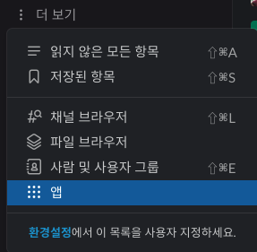

- slack 더보기 > 앱 을 선택합니다. 

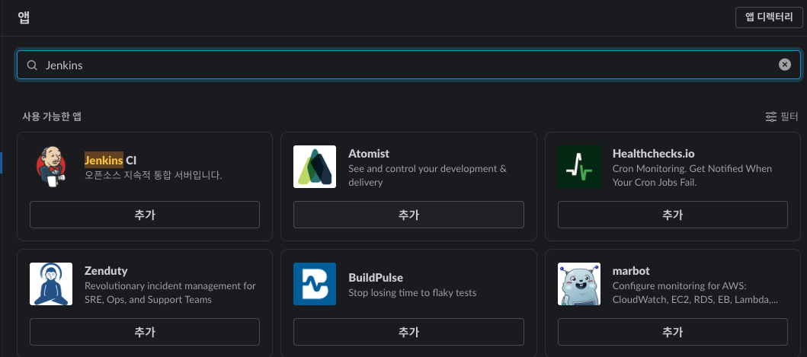

- 앱에서 Jenkins 를 클릭하여 "Jenkins CI" 플러그인을 설치한다. 

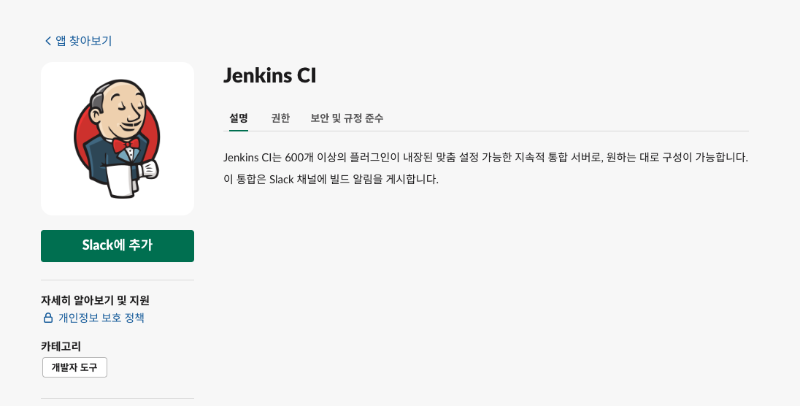

- 앱 화면이 나오면 Slack 에 추가 버튼을 클릭하여 Slack에 등록합니다. png

### 채널 생성하기 

- slack에서 채널 생성을 합니다 

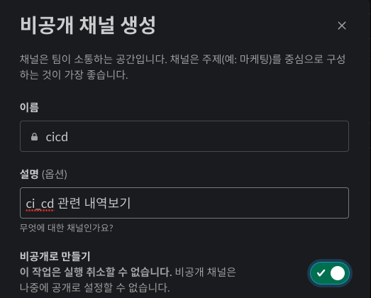

- 위와 같이 이름을 cicd 로 설정한다. 
- 설명은 사용자가 알기 쉽게 작성해 준다. 
- "비공개로 만들기" 를 활성화 한다. 

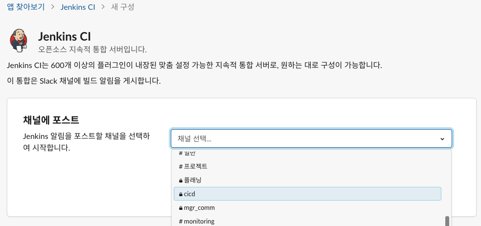

- Jenkins CI 선택화면에서 이전에 만든 cicd를 선택한다. 
- 이는 jenkins에서 slack 으로 메시지를 보내면 채널로 전송된다.

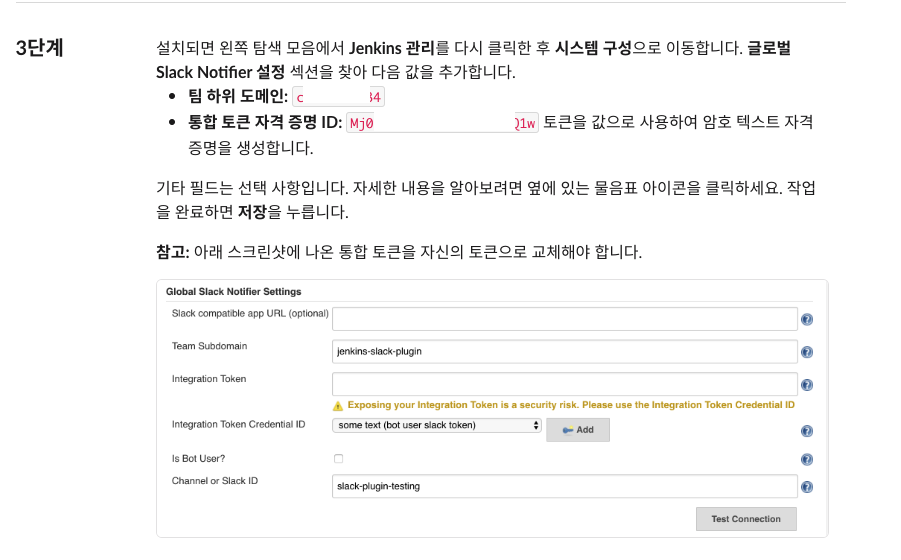

- 3단계 부분에서 다음 붉은색 글씨를 복제해둔다. 
  - 팀 하위 도메인
  - 통합 토큰 자격 증명 ID

## Jenkins 설정하기 

- 대시보드 > Jenkins 관리 를 클릭한다. 

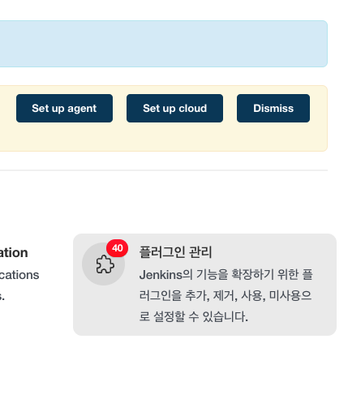

- 이후 플러그인 관리를 선택한다. 

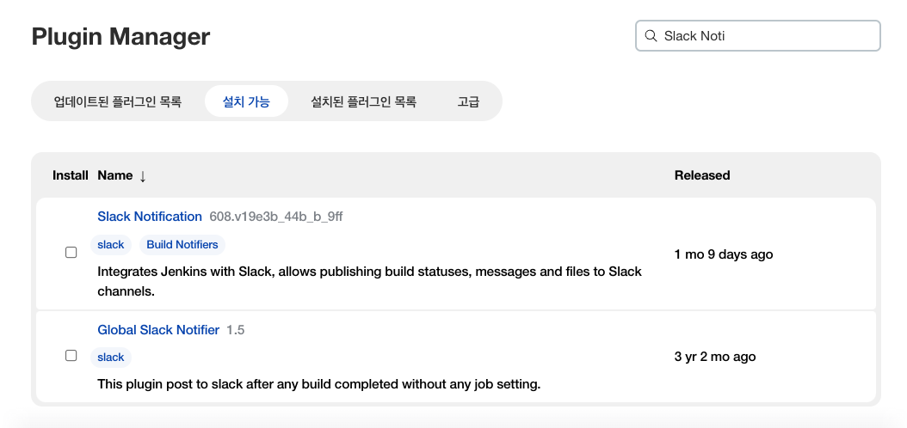

- 플러그인 매니저에서 slack noti 를 찾는다. 
- 그리고 Slack Notification, Global Slack Notifier 를 선택한다. 
- 아래 플러그린 설치를 수행한다. 

### Jenkins 시스템 설정하기 

- 대시보드 > Jenkins 관리 > 시스템 설정 을 선택한다. 
  
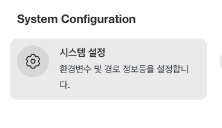

- 맨아래 Slack을 선택한다. 

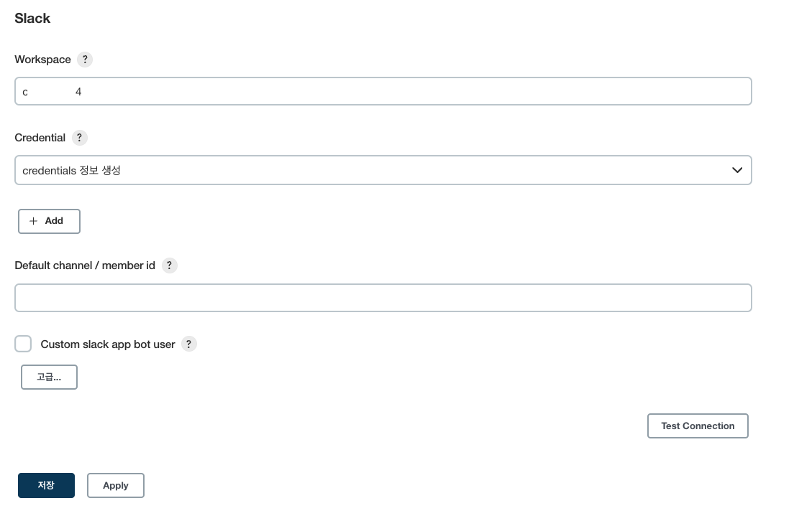

- Workspace 영역에 이전에 복사한 "팀 하위 도메인" 값을 붙여 넣는다. 
- Credential은 처음에 존재하지 않으므로 "+ Add" 를 클릭 > Jenkins를 클릭한다. 

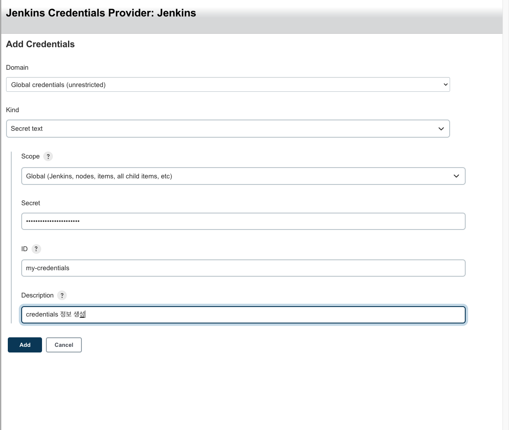

- Kind: Secret text 를 선택합니다. 
- Scope: Global 을 선택한다. 
- Secret: 이전에 복사한 "통합 토큰 자격 증명 ID" 의 값을 붙여 넣는다. 
- ID: 구분할 이름을 지정한다. 
- Description: 리스트에 노출할 값을 입력한다. 


- 최종적으로 Slack 정보를 위와 같이 지정한다. 

## Jenkins File 수정하기. 

- 이제 JenkinsFile 을 아래와 같이 수정한다. 

```py

pipeline {
  agent any
  environment {
    def dockerHome = tool 'myDocker'
    PATH = "${dockerHome}/bin:${env.PATH}"
  }
  options {
    skipDefaultCheckout(true)
  }
  stages{
    stage('clean workspace') {
      steps {
        cleanWs()
      }
    }
    stage('Initialize') {
      steps {
        echo "env ${env.PATH}"
      }
    }
    stage('checkout') {
      steps {
        checkout scm
      }
    }
    stage('tfsec') {
      failFast true
      steps {
        echo "=========== Execute tfsec ================="
        // sh 'docker run --rm -i -v "$(pwd):/src" aquasec/tfsec /src --no-color'
        sh 'chmod 755 ./tfsecw.sh'
        sh './tfsecw.sh'
      }

      post {
        always { 
          echo "========= Check tfsec test results ========="
          junit allowEmptyResults: true, testResults: 'tfsec_results.xml', skipPublishingChecks: true
        }
        success {
          slackSend channel: '', color: 'good', message: 'SUCCESSFUL', teamDomain: '', tokenCredentialId: 'secret-text'
          echo "Tfsec passed" 
        }
        unstable {
          script {
            TFSEC_RESULTS = sh (
              script: 'cat tfsec_results.xml',
              returnStdout: true
            ).trim()
            slackSend channel: '', color: 'danger', message: "[tfsec terraform] Unstable: ${TFSEC_RESULTS}", teamDomain: '', tokenCredentialId: 'secret-text' 
          }
          error "TfSec Unstable"
        }
        failure {
          script {
            TFSEC_RESULTS = sh (
              script: 'cat tfsec_results.xml',
              returnStdout: true
            ).trim()
            slackSend channel: '', color: 'danger', message: "[tfsec terraform] Failed: ${TFSEC_RESULTS}", teamDomain: '', tokenCredentialId: 'secret-text' 
          }
          error "Tfsec failed"
        }
      }
    }
  }
  post {
    always {
      cleanWs()
    }
  }
}
```

#### success: 성공한 경우 아래와 같이 내용을 추가한다. 

```py
        success {
          slackSend channel: '', color: 'good', message: 'SUCCESSFUL', teamDomain: '', tokenCredentialId: 'secret-text'
          echo "Tfsec passed" 
        }
```

- 위와 같이 slackSend 를 작성하고, 성공한경우 message에 지정한 값이 슬랙으로 전송된다. 
  


- 위와 같이 slack의 cicd 에 출력된다. 

#### 불안정 상태인경우 tfsec 테스트결과 불안정 상태가 된다. 

```py
        unstable {
          script {
            TFSEC_RESULTS = sh (
              script: 'cat tfsec_results.xml',
              returnStdout: true
            ).trim()
            slackSend channel: '', color: 'danger', message: "[tfsec terraform] Unstable: ${TFSEC_RESULTS}", teamDomain: '', tokenCredentialId: 'secret-text' 
          }
          error "TfSec Unstable"
        }
```

- 위와 같이 script로 감싸고, tfsec_results.xml 값을 출력하고 변수 TFSEC_RESULLTS에 추가한다. 
- 그리고 slsckSend 부분에 'message: "[tfsec terraform] Unstable: ${TFSEC_RESULTS}"' 으로 변경한다. 
- 이때 반드시 message: 부분은 (") 으로 문자열을 지정해 주어야한다. (') 인경우 정상적으로 파싱되지 않는다. 

#### 실패인경우 

```py
        failure {
          script {
            TFSEC_RESULTS = sh (
              script: 'cat tfsec_results.xml',
              returnStdout: true
            ).trim()
            slackSend channel: '', color: 'danger', message: "[tfsec terraform] Failed: ${TFSEC_RESULTS}", teamDomain: '', tokenCredentialId: 'secret-text' 
          }
          error "Tfsec failed"
        }
      }
```

- 실패인경우 역시 동일하게 작성해준다. 

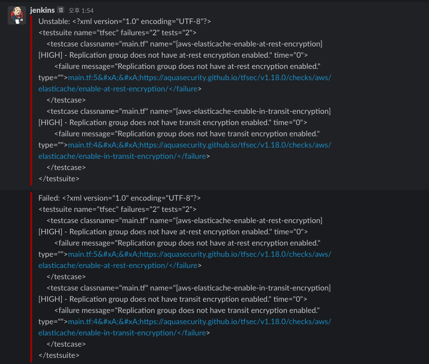

- 위와 같이 slack의 cicd 에 출력된다. 


